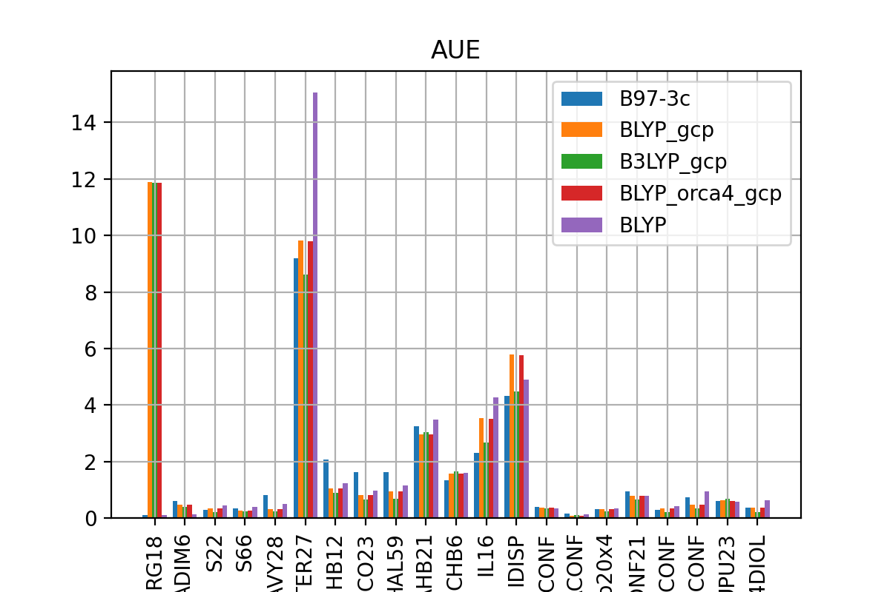

# GMTKN55
reproduce the benchmark from DOI:10.1039/C7CP04913G  

# A problem in using GCP with DFT especially with rare gases (RG18 data set)

# orca template in ORCA_tmp
## 01_B973c.inp
! B97-3c TightSCF NOSOSCF  
ORCA5  

## 02_BLYP.inp
! BLYP D3 GCP(DFT/TZ) def2-TZVPP def2/J TightSCF NOSOSCF  
read optimized wave function from 01_B973c  
ORCA5  

## 03_B3LYP.inp
! B3LYP D3 RIJCOSX GCP(DFT/TZ) def2-TZVPP def2/J TightSCF NOSOSCF  
read optimized wave function from 02_BLYP  
ORCA5  

## 04_DLPNOCCSDT.inp  
! DLPNO-CCSD(T) def2-QZVPP def2-QZVPP/C RIJCOSX def2/J TIGHTSCF TIGHTPNO NOSOSCF  
This job require heavy IO  
ORCA5  

## 05_BLYP_orca4.inp
! BLYP D3 GCP(DFT/TZ) def2-TZVPP def2/J TightSCF NOSOSCF Grid4
ORCA4  
orca4/5 gbw files are not compatibale for each other

## 06
! BLYP D3 def2-TZVPP def2/J TightSCF NOSOSCF  
ORCA5  
no gcp correction